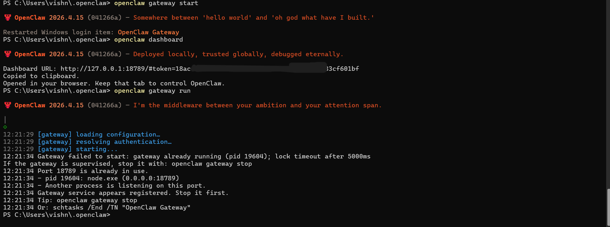
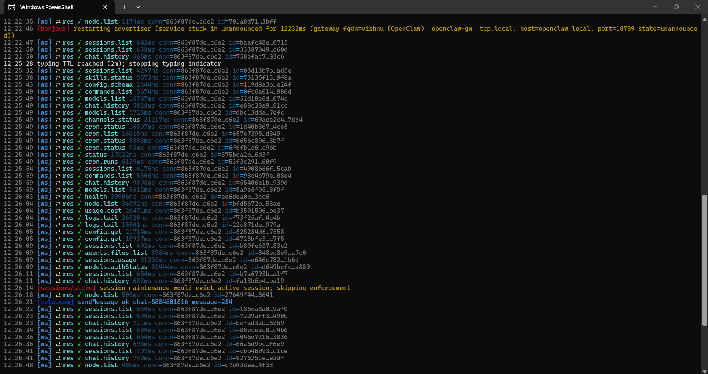
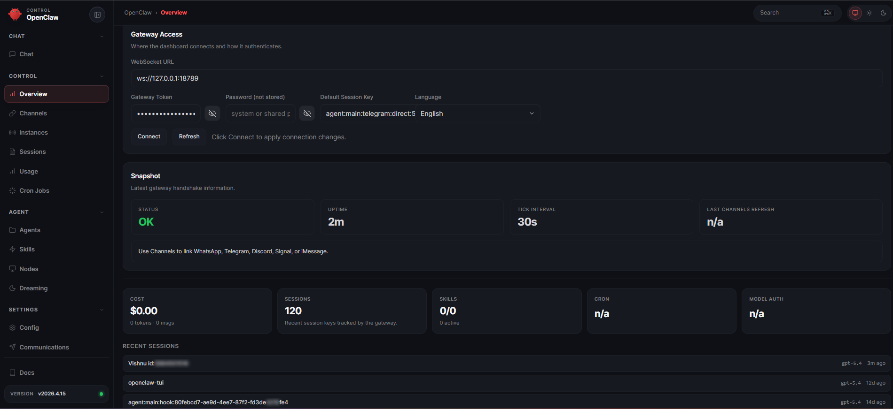
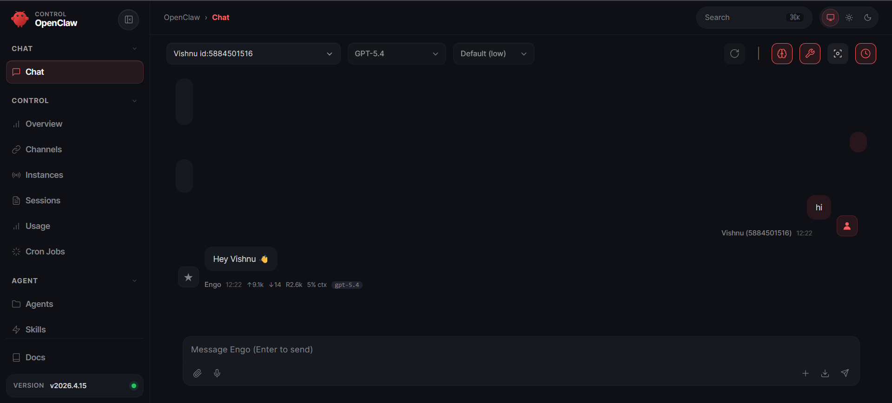
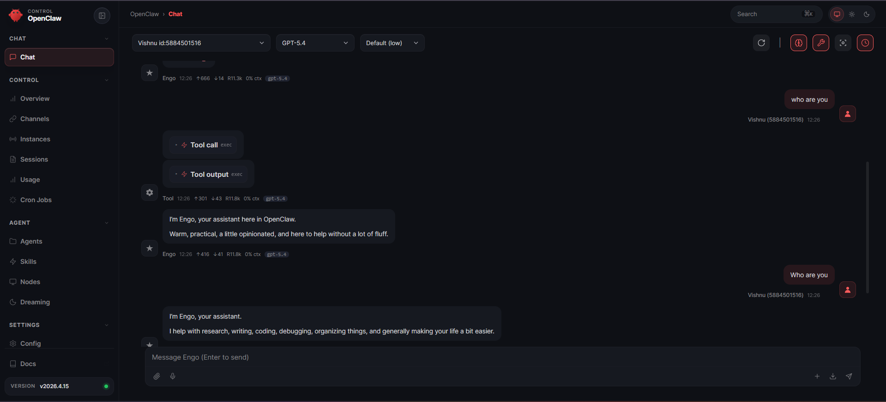
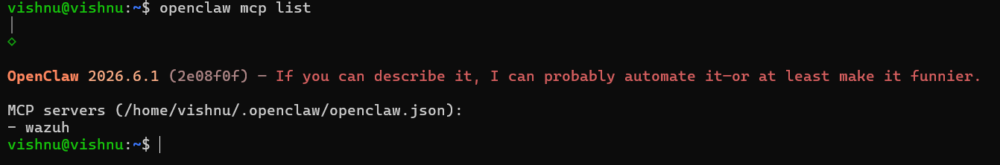
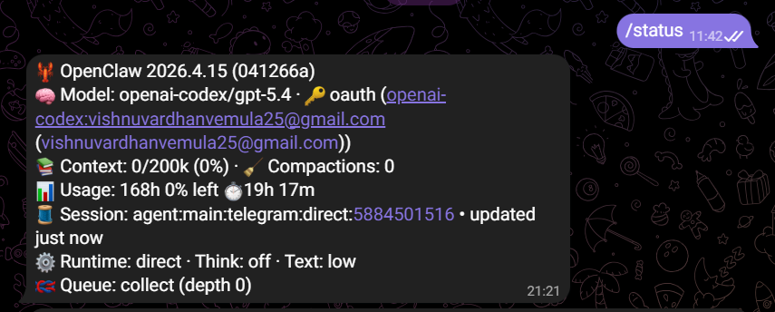
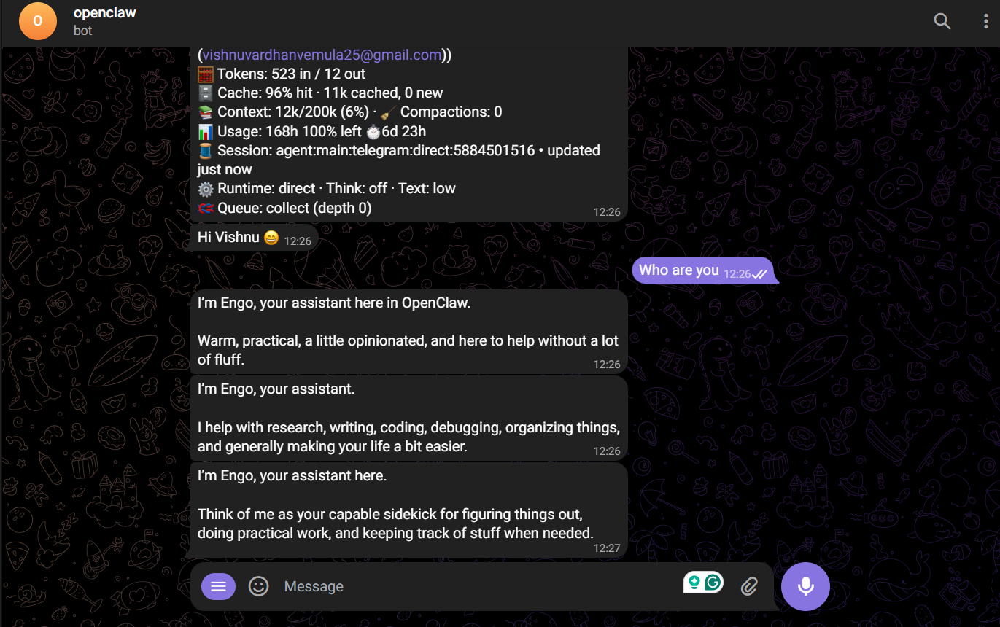

# soc_automationtin

## Move to point 14 to view MCP server details

- **Automated SOC Pipeline:** Built using Wazuh to detect real-time threats and trigger workflows automatically.
- **Workflow Automation 1:** n8n processes alerts and forwards them to Catalyst via REST API.
- **Workflow Automation 2:** openclaw processes alerts, summarizes, and forwards them to Catalyst.
- **Incident Management:** Automatically creates and manages tickets for detected attacks.

## -----------Move to point 14 to view MCP server details--------------

##  Tech Stack

- **Kali Linux (VMware Workstation)** — Wazuh Manager + Catalyst
- **Windows 11 Host** — Wazuh Agent + n8n (Docker)
- **Python 3** — Integration script
- **Bun + Vue.js** — Frontend
- **Go** — Backend

## Workflow

1. Wazuh detects a security event on the Windows agent  
2. Custom Python script sends alert data (JSON)  
3. n8n receives data via webhook  
4. n8n transforms and sends data to Catalyst API  
5. Catalyst creates an incident ticket  
6. Analyst reviews and manages the alert
7. In place of 3 and 4, we created automation via OpenClaw, which reads and analyzes the logs and summarizes via MCP server and REST API 
## Screenshots

### 1. Wazuh Manager Running

### 2. Wazuh Agent status

### 3. Catalyst Running

### 4. Custom Integration Script

### 5. n8n Running in Docker Desktop

### 6. Nmap Attack Simulation

### 7. n8n Workflow 

### 8. Catalyst — Auto-Created Alert Tickets

### 9. Exporting Alerts to Excel

### 10. HTTP Server Serving Files

### 11. Excel files

### 12. OpenClaw setup and running to replace n8n for automation

### 13. OpenClaw Dashboard

### 14. MCP server
MCP server connects with Wazuh manager and indexer
- Refer to [wazuh-mcp-server.py](wazuh-mcp-server.py) for MCP server details.

### 15. Communicating with a Telegram bot

