# soc_automationtin
## Screenshots

### 1. Wazuh Manager Running
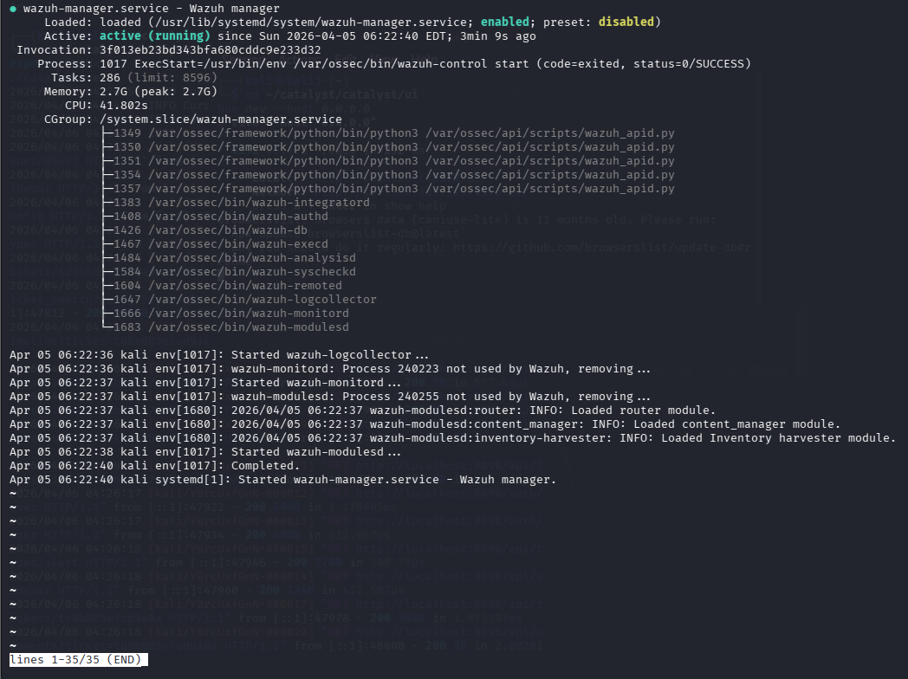

### 2. Wazuh Agent status
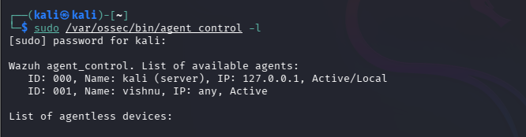

### 3. Catalyst Running
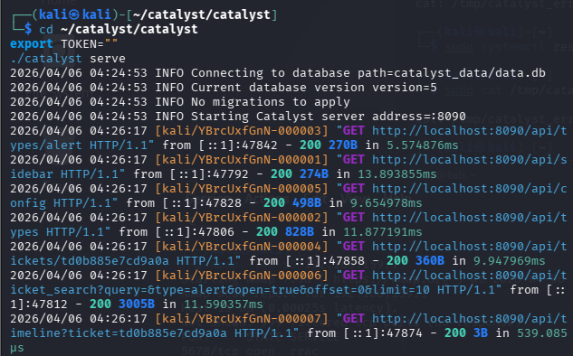
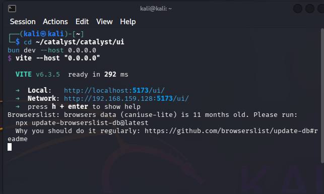

### 4. Custom Integration Script
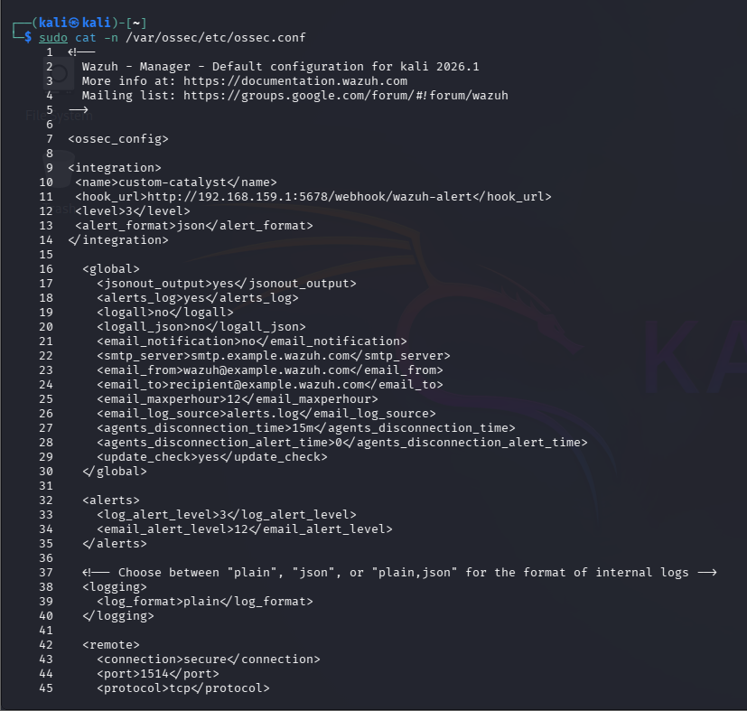
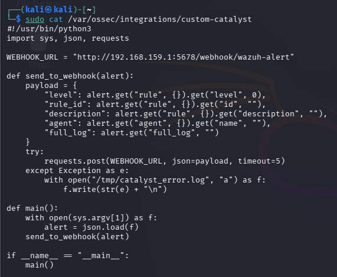

### 5. n8n Running in Docker Desktop
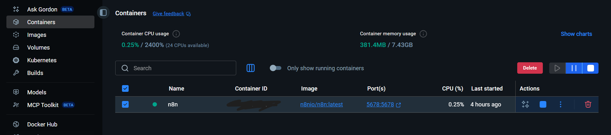

### 6. Nmap Attack Simulation
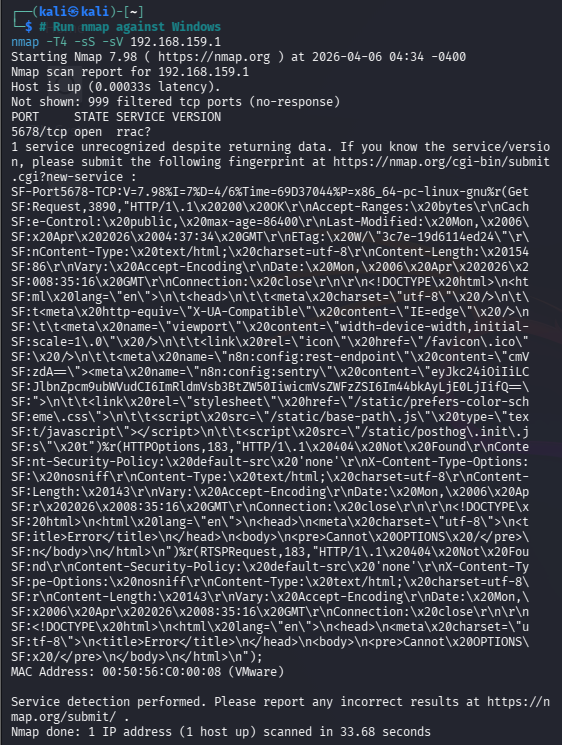
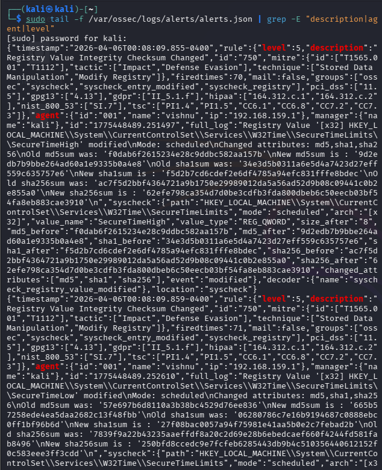

### 7. n8n Workflow 
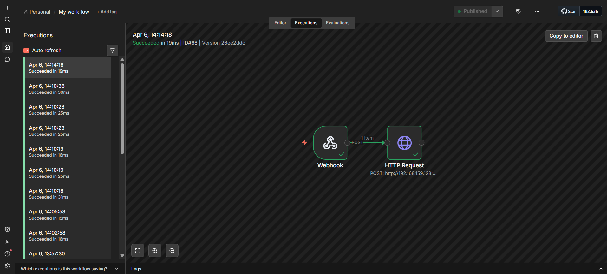

### 8. Catalyst — Auto-Created Alert Tickets
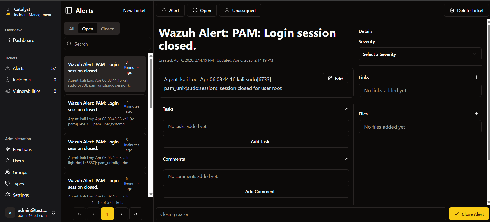

### 9. Exporting Alerts to Excel
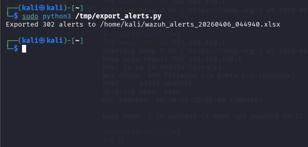
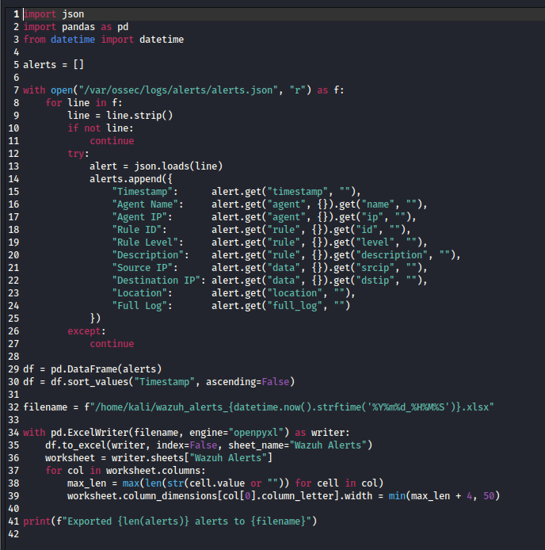

### 10. HTTP Server Serving Files
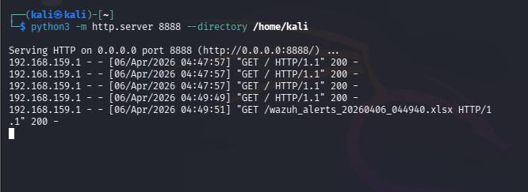
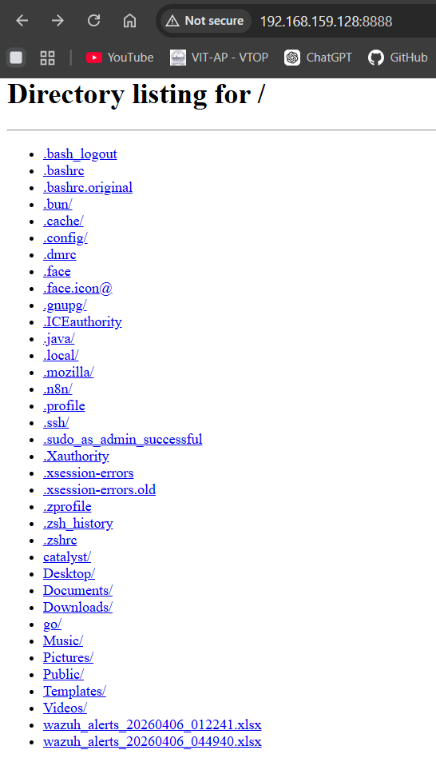

### 11. Excel files
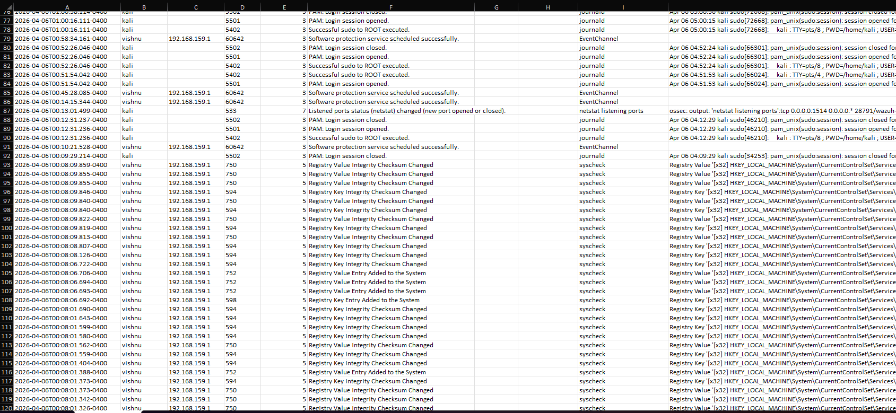
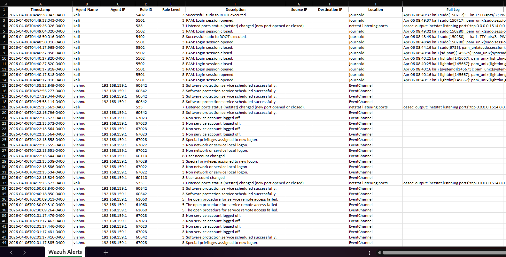
